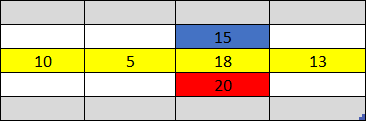
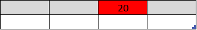
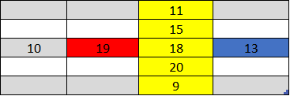
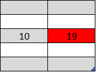
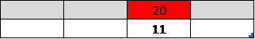
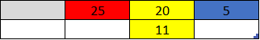
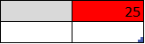
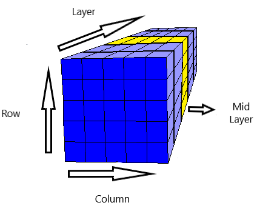
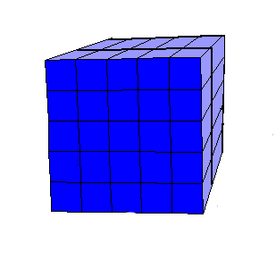

**Peak detection by Improved Divide & Conquer on 2D and 3D arrays** 
>More information about Improved Divide & Conquer [page 5] : [Peak Finding 1D and 2D](https://ocw.mit.edu/courses/electrical-engineering-and-computer-science/6-006-introduction-to-algorithms-fall-2011/lecture-videos/MIT6_006F11_lec01.pdf) 
>For algorithm analysis and more details, take a look at [doc](docs/PeakFinder.pdf)

# Peak Finder 2D

1- Find middle row/column, then pick a number in middle row/column  => **O(1)** 
2- Check if the number is peak number, if it is a peak number then return it => **O(1)** 
3- Find max number in row/column => **O(m) or O(n)** 
4- Check if the number is peak number, if it is a peak number then return it => **O(1)** 
5- Compare max number with its neighbors => **O(1)** 
- If the max’s neighbor is bigger than max, then maintain search on neighbor’s part => **O(1)** 

> arr[midRow+1][max] > arr[midRow][max] 
> arr[max][midCol+1] > arr[max][midCol]

- If the max’s other neighbor is bigger, then maintain search on this neigbor’s part => **O(1)** 

> arr[midRow-1][max] > arr[midRow][max] 
> arr[max][midCol-1] > arr[max][midCol] 

**Improved Divide & Conquer 2D Runtime Chart** 

| n (number of rows) | m (number of columns) | rowOrCol | Time(ns) |
| ------------------ | --------------------- | -------- | -------- |
| 10                 | 100                   | 0        | 13800    |
| 10                 | 100                   | 1        | 12500    |
| 10                 | 100                   | 2        | 3900     |
| 100                | 10                    | 0        | 11800    |
| 100                | 10                    | 1        | 15100    |
| 100                | 10                    | 2        | 9100     |
| 50                 | 200                   | 0        | 197599   |
| 50                 | 200                   | 1        | 151499   |
| 50                 | 200                   | 2        | 85700    |
| 200                | 50                    | 0        | 245500   |
| 200                | 50                    | 1        | 37600    |
| 200                | 50                    | 2        | 474699   |
| 50                 | 1000                  | 0        | 219700   |
| 50                 | 1000                  | 1        | 158200   |
| 50                 | 1000                  | 2        | 449800   |
| 1000               | 50                    | 0        | 241600   |
| 1000               | 50                    | 1        | 135099   |
| 1000               | 50                    | 2        | 78700    |
| 50                 | 10000                 | 0        | 1661400  |
| 50                 | 10000                 | 1        | 126201   |
| 50                 | 10000                 | 2        | 680400   |
| 10000              | 50                    | 0        | 230900   |
| 10000              | 50                    | 1        | 143999   |
| 10000              | 50                    | 2        | 1238900  |

---

**Condition 1** : rowOrCol = 0 ---> array is split by rows

  
  =>
  

**Condition 2** : rowOrCol = 1 ---> array is split by columns

  
  =>
  

**Condition 3** : rowOrCol = 2 ---> first, array is split by rows then columns

  
  =>
  
  =>
  
  =>
  

# Peak Finder 3D

1- Find middle layer, then pick a number in midLayer => **O(1)** 
2- Check if the number is peak number, if it is a peak number then return it => **O(1)** 
3- Find max number in midLayer => **O(mn)** 
4- Check if the number is peak number, if it is a peak number then return it => **O(1)** 
5- 5-	Compare max number with its neighbors => **O(1)**
 - If the max’s neighbor is bigger than max, then maintain search on neighbor’s part => **O(1)**
>arr[max][max][midLayer] > arr[max][max][midLayer+1] 

 - If the max’s other neighbor is bigger, then maintain search on this neighbor’s part => **O(1)**
>arr[max][max][midLayer] > arr[max][max][midLayer-1] 

  
  =====>
  

